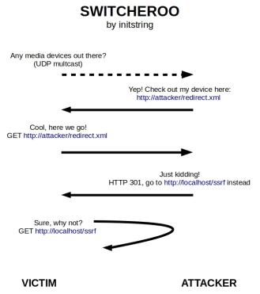

# switcheroo

## Overview
Switcheroo is a POC demonstrating a universal SSRF strategy for LAN-based attacks against vulnerable SSDP services. One such service happens to be included in default installations of Microsoft Windows.

You can read the full details in my blog [here](https://initblog.com/xxx).



## Utilization
The tool should be run from a Linux host with vulnerable systems on the same network segment. It will listen for SSDP multicast discover requests, replying to them with fake device description URL. When the SSDP service on a vulnerable system accesses that URL, the tool will reply with an HTTP 301 redirect to an arbitrary URL that you provide with the `-u` option. This URL can be anything on any host (including localhost and protected networks).

You can tell switcheroo to reply only to a specific host by supplying the IP address of your target with `-t`. Or, run it "karma-mode" style with `-t "*"`.

You also must provide the interface your attacking machine will host the HTTP redirect on. By default, it will bind to 8888 but you can change this with `-p`.

**Full Help**
```
usage: switcheroo.py [-h] -i INTERFACE [-p PORT] -u URL -t TARGET

optional arguments:
  -h, --help            show this help message and exit
  -i INTERFACE, --interface INTERFACE
                        Network interface to listen on.
  -p PORT, --port PORT  Port for HTTP server. Defaults to 8888.
  -u URL, --url URL     Force target to perform a GET here
  -t TARGET, --target TARGET
                        Target victim. Enter an IP or "*"
```
